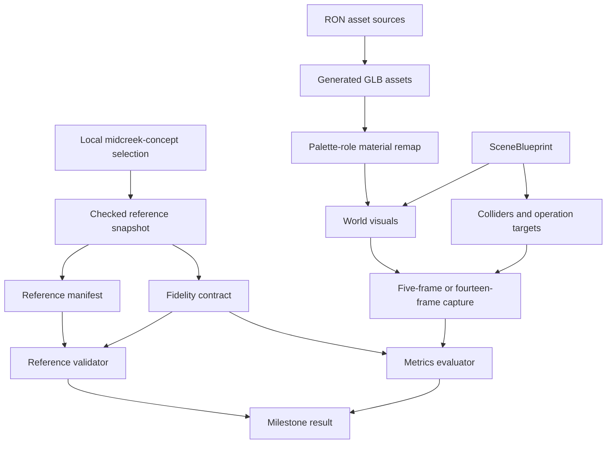
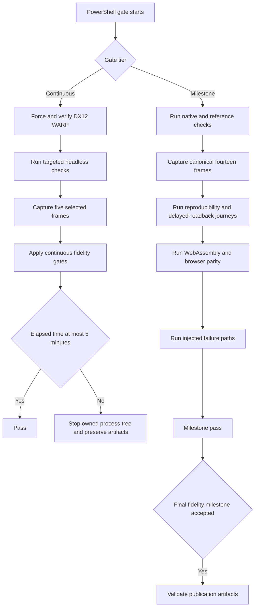

# Cell Shift Phase 2 Hill Climb - Plan

## Goal Capsule

- **Objective:** A Windows developer can rapidly improve a playable Cell Shift proof of concept until its rendered scene, technician, equipment, and interface match the latest Cel Shift direction through measurable evidence.
- **Means:** Rebuild visual fidelity from the reference foundation upward, while preserving the current repair simulation.
- **Product authority:** The complete latest local `midcreek-concept` Cel Shift working tree is the sole visual authority. The current game defines existing gameplay behavior.
- **Execution profile:** Native Windows, PowerShell, and the software rendering adapter form the primary development loop.
- **Open blockers:** None. U1 must snapshot the mutable local reference source before scene implementation starts.

---

## Product Contract

This implementation plan preserves the confirmed Product Contract and all R, A, F, and AE identifiers.

### Summary

Phase 2 will replace the current proof of concept's incorrect visual foundation with a reference-driven Cell Shift scene.
Phase 2 will perform the reference and gate enablement in G0 before visual work.
It will not accept that enablement as Phase 2 progress.
After G0, additional infrastructure and publication work must unblock a visible milestone or final delivery.
The result will keep the current playable repair loop and one man technician.

### Problem Frame

The current proof of concept passes its automated visual gates but does not look like the approved key art.
Its 57-degree camera, low rack mass, high floor mass, floor grid, row layout, and static unlit shadow roles conflict with the latest Cel Shift direction.
The approved key art also fails the gate that carries its name because its measured luminance is below the current minimum.

The first hill climb spent approximately 15 hours on GitHub Pages and nondeterministic testing.
It produced no simulation or rendering improvement.
Phase 2 must prevent infrastructure work from displacing visible fidelity work again.

### Key Decisions

- **Visual gains lead the work.** (session-settled: user-approved — chosen over gate-first hardening: the prior hill climb produced no graphics or simulation gains.) Governs R4, R23.
- **Use a reference-pyramid rebuild.** (session-settled: user-approved — chosen over parallel scene replacement and incremental mutation: the current camera, composition, topology, and shading form the wrong foundation.) Governs R4-R12.
- **Use the complete latest Cel Shift set as the visual authority.** (session-settled: user-directed — chosen over retaining the old two-image contract: the old contract omits most current visual evidence.) Governs R1-R3.
- **Use measurable acceptance without subjective approval.** (session-settled: user-directed — chosen over human visual approval: fidelity must remain reproducible and reviewable.) Governs R17-R22.
- **Preserve gameplay and use one man technician.** (session-settled: user-directed — chosen over expanding the simulation or technician roster: Phase 2 is a visual hill climb.) Governs R13-R16.
- **Use a tiered verification loop.** (session-settled: user-approved — chosen over running the complete render and web suite after each art change: continuous feedback must stay within five minutes.) Governs R17-R20.
- **Make native Windows the primary workflow.** (session-settled: user-approved — chosen over WSL2 as the main environment: implementation will occur on a Windows devbox.) Governs R25-R27.
- **Do not add a game frame-rate target.** (session-settled: user-directed — chosen over a new runtime performance gate: Phase 2 optimizes fidelity and engineering feedback time.) Governs R24.

### Requirements

**Visual authority**

- R1. Phase 2 must use the complete latest local Cel Shift reference set, written direction, and approved artwork from `midcreek-concept` as its sole visual authority.
- R2. Phase 2 must bind the exact authority inputs to reproducible source identities or content hashes before implementation changes those inputs.
- R3. Every fidelity gate must identify its owning reference so that the retired two-image contract cannot override newer authority.

**Visual foundation and scene**

- R4. The first accepted Phase 2 milestone must be a higher-fidelity representative healthy scene, not a gate-infrastructure or publication milestone.
- R5. The scene must use an orthographic isometric-style camera whose elevation is derived from the authority image's measured projected row angle, with one declared tolerance and four 90-degree orbit headings.
- R6. The representative composition must converge on reference-defined rack mass, floor mass, rack-to-floor balance, equipment placement, technician scale, and world-only regions.
- R7. The hall must use plain polished concrete, back-to-back rack-row pairs, alternating service and cold aisles, yellow chamfered containment kerbs, service-side charcoal hoses, and ordered overhead routing.
- R8. Cel Shift rendering must use large flat colors, no more than one hard-edged shadow tone, stable dark outlines, and an orbit-safe light terminator without gradients, ambient occlusion, texture, or grain.
- R9. The scene must include the reference-defining asset families: two rack types, cooling equipment, containment kerbs, hoses, brass quick-disconnects with colored collars, tiered trays and manifolds, a red cart, and a yellow stool.
- R10. The man technician must measure 1.73 m against 2.10 m racks, reach approximately 82% of rack height at the hard hat, and preserve the approved silhouette, identity, personal protective equipment, facings, and Idle, Walk, and Repair actions.
- R11. The interface must preserve the approved Cell Shift frame language through a bottom toolbar, top-right minimap, compact status panel, and shape-and-color floating fault and work badges.
- R12. Healthy, fault, repair, alarm, and low-power presentation must use the latest reference direction without adding simulation mechanics only to reproduce reference-only scenes.

**Playability and scope preservation**

- R13. Phase 2 must preserve view-relative movement, four-step orbit, recurring prioritized faults, in-range repair, repair completion, and the ticket workflow.
- R14. The rebuilt geometry must keep required repair targets reachable with the existing player controls and collision semantics.
- R15. Phase 2 must use one man technician and must not add staffing, crew, or second-technician behavior.
- R16. Production assets must remain generated from declarative sources without manual Blender or other digital content creation work.

**Fidelity evidence and feedback time**

- R17. Headless checks must own camera relations, scene geometry, collision and reachability, asset and material bindings, rig structure, animation state, operations state, and interface placement where pixels are not required.
- R18. The continuous real-render gate must capture five representative frames: healthy center northeast, repairing northeast, mid-orbit, corner northeast, and the low-resolution ticket queue.
- R19. The continuous gate must target 2-3 minutes on the Windows software rendering adapter and must not exceed 5 minutes.
- R20. Milestone gates must run the complete 14-frame journey, independent reproducibility, delayed readback, injected failure paths, native checks, WebAssembly packaging, browser checks, and the complete role-specific reference coverage due through that milestone. M3 must run the complete R1-R27 contract.
- R21. An approved reference must pass every fidelity gate enforced in its name. Each calibrated near-boundary negative fixture must fail its named gate, and an empty-floor corner frame must fail at least one fidelity gate.
- R22. Automated evidence must cover composition, scale, placement, all four headings, silhouettes, state presentation, world-only regions, final colors, outlines, aliasing, depth conflicts, and interface rasterization.
- R23. Work on determinism, gate orchestration, or delivery must stop when it does not unblock the next visual milestone, an existing-gameplay requirement, or a final-delivery requirement.
- R24. Phase 2 must not add a native or browser frame-rate acceptance target.

**Windows and delivery**

- R25. The primary local workflow must run natively on Windows through PowerShell and explicitly select the software rendering adapter.
- R26. The Windows workflow must account for disabled Rust incremental compilation on ReFS Dev Drives and must provide clear failures when required rendering or browser capabilities are unavailable.
- R27. Linux continuous integration, WebAssembly parity, browser readiness, and GitHub Pages publication must remain milestone or final-delivery gates rather than continuous art-iteration gates.

### Actors

- A1. The Windows developer changes generated scene, asset, rendering, technician, or interface inputs and receives bounded automated feedback.
- A2. The player uses the current controls to navigate, orbit, prioritize faults, repair equipment, and observe state changes.
- A3. The verification system compares structural and rendered evidence with the bound Cel Shift authority.

### Key Flows

- F1. Visual iteration
  - **Trigger:** A1 changes a visual input.
  - **Steps:** Run structural checks, capture the five representative frames, evaluate the owned fidelity measures, and reject any gate run longer than five minutes.
  - **Outcome:** A1 receives fast evidence about the changed visual area without running publication work.
  - **Covers:** R17-R19, R23.
- F2. Playable repair loop
  - **Trigger:** A2 starts the proof of concept.
  - **Steps:** Move through the rebuilt hall, orbit the camera, select a prioritized fault, reach the target, repair it, and observe the updated ticket and equipment state.
  - **Outcome:** The Phase 1 gameplay loop remains complete inside the rebuilt scene.
  - **Covers:** R13-R15.
- F3. Milestone acceptance
  - **Trigger:** A visual foundation, asset-family, state-coverage, or release milestone is ready.
  - **Steps:** Run complete native, rendered-reference, reproducibility, failure-path, WebAssembly, and browser gates.
  - **Outcome:** The milestone advances only when fast-loop gains satisfy all requirements due through that milestone. M3 advances only when the complete product contract passes.
  - **Covers:** R20-R22, R25-R27.

### Acceptance Examples

- AE1. Reference-correct first frame
  - **Covers R4-R10.**
  - **Given:** The healthy center northeast scene uses the first milestone content.
  - **When:** The representative render gate captures the frame.
  - **Then:** Camera elevation, rack and floor mass, row topology, technician scale, Cel Shift bands, outlines, and defining equipment placements satisfy their bound references.
- AE2. Orbit-safe rendering
  - **Covers R5, R8, R10, R22.**
  - **Given:** The same hall and technician appear at all four headings.
  - **When:** The camera completes each 90-degree orbit.
  - **Then:** Composition, silhouettes, facings, hard shadow bands, outlines, and state badges remain valid without static-face lighting artifacts.
- AE3. Preserved gameplay
  - **Covers R13-R15.**
  - **Given:** Recurring faults are active in the rebuilt hall.
  - **When:** The player moves, orbits, reaches a target, and completes a repair.
  - **Then:** Prioritization, interaction range, repair progress, completion, and ticket updates keep their Phase 1 behavior.
- AE4. Calibrated rejection
  - **Covers R3, R21-R22.**
  - **Given:** Each analyzer has an authority measurement, declared bound, exact capture assignment, and near-boundary negative fixture.
  - **When:** The reference contract validates each analyzer and combines all references assigned to one checkpoint.
  - **Then:** Every authority image passes, every negative fixture fails its named gate, the empty-floor capture fails at least one gate, and every combined acceptance range is nonempty.
- AE5. Bounded visual feedback
  - **Covers R18-R19, R23.**
  - **Given:** The Windows devbox uses the selected software adapter.
  - **When:** A1 runs the continuous visual gate.
  - **Then:** The five-frame result completes in 2-3 minutes where possible and never exceeds 5 minutes.
- AE6. Complete milestone proof
  - **Covers R20, R27.**
  - **Given:** A milestone passes its continuous checks.
  - **When:** The milestone gate runs.
  - **Then:** All 14 captures, reproducibility paths, failure paths, native checks, WebAssembly packaging, browser checks, and active role-specific reference checks pass before the milestone closes. M3 also passes the complete R1-R27 contract.

### Success Criteria

- The first accepted deliverable is a measurably improved rendered healthy scene with the corrected camera, composition, topology, Cel Shift shading, and technician scale.
- Each later milestone adds visible reference coverage through asset families, technician and interface fidelity, state presentation, and four-heading stability.
- The continuous five-frame gate meets R19 on the target Windows devbox.
- The final playable proof of concept satisfies R13 across the rebuilt hall and satisfies the complete evidence requirements in R20-R22.
- Infrastructure work does not become a milestone unless it directly unblocks a visual, existing-gameplay, or final-delivery requirement.

### Scope Boundaries

- Do not add new gameplay systems, fault mechanics, staffing, crew management, a second technician, multiplayer, persistence, procedural layouts, economy, inventory, audio, or continuous camera controls.
- Do not add manual Blender or other digital content creation work.
- Do not use human screenshot approval, human playtests, or subjective visual scores as acceptance gates.
- Do not treat GitHub Pages, browser publication, full nondeterminism analysis, delayed-readback proof, or injected watchdog failures as continuous inner-loop work.
- Do not optimize game frame rate as a Phase 2 outcome.

### Dependencies and Assumptions

- The current dirty `midcreek-concept` working tree remains available until U1 copies the selected files and records their source revision and content hashes.
- The Windows devbox can run the pinned Rust and WebAssembly toolchains and can expose a supported software rendering adapter.
- Phase 1 gameplay semantics remain the behavior authority when visual reconstruction changes geometry or presentation.
- Gate-duration acceptance is measured on the target Windows devbox, not inferred from Linux continuous integration.

### Sources and Research

- Current product contract: `docs/implementation-plan.md`, `docs/progress.json`, and `README.md`.
- Current camera, scene, gameplay, asset, interface, and verification behavior: `src/` and `tests/`.
- Current vendored reference scope: `docs/reference/manifest.json`.
- External visual authority: `midcreek-concept` repository files `ART-BIBLE.md`, `themes/_shared/foundation.md`, `themes/_shared/character-sheet.md`, `themes/cel-shift/theme.yaml`, Cel Shift prompts and masters, and `docs/superpowers/specs/2026-08-31-reference-fidelity-design.md`.

---

## Planning Contract

### Key Technical Decisions

- KTD1. **Snapshot the complete visual authority in this repository.** Copy the selected Cel Shift documents and images into `docs/reference/cel-shift/`. Extend `docs/reference/manifest.json` with the source repository, source `HEAD`, selected-file hash, per-file hash, dimensions, media type, and reference role. The accepted snapshot must not depend on a sibling checkout after it is created. This decision implements R1-R3 and R21-R22.
- KTD2. **Add an independent capture-profile abstraction.** Keep `FrameName::ALL` and its order as the canonical fourteen-frame journey. Add a five-frame `Continuous` journey plan that selects healthy center northeast, repairing northeast, mid-orbit, corner northeast, and low-resolution ticket queue captures. The profile must own required transitions, capture readbacks, expected artifacts, report identity, completeness checks, and watchdog budgets. For each shared frame, the continuous and canonical profiles must produce equivalent semantic preconditions, frame facts, analyzer inputs, and pixel hashes. Do not use test filtering as a capture-cost control. (session-settled: user-directed — chosen over reducing the canonical journey: the full milestone contract must remain intact while the edit loop becomes faster.) This decision implements R18-R20 and R23.
- KTD3. **Use Microsoft WARP as the Windows software-render authority.** The PowerShell gate must set `WGPU_BACKEND=dx12` and `WGPU_FORCE_FALLBACK_ADAPTER=1`. The game must report the selected `RenderAdapterInfo` before capture. The gate must reject any adapter whose backend is not DX12, device type is not CPU, or name does not contain `Microsoft Basic Render Driver`. Before M1, run the same positive and near-boundary negative fixtures on WARP, llvmpipe, and SwiftShader. Permit per-metric adapter slack only up to the measured delta plus one metric quantization unit, and require every negative fixture to fail on every adapter. Store measured values and their source hashes in `docs/reference/adapter-calibration.json`. (session-settled: user-directed — chosen over hardware-specific native rendering: Phase 2 needs one reproducible Windows adapter.) This decision implements R25-R26.
- KTD4. **Derive the camera from one projection model.** Measure the projected row angle in the authority image and derive the orthographic camera elevation from that measurement. Use one declared tolerance, four 90-degree headings, one target, one fitted hall extent, and derived view-basis values. Keep movement relative to `ViewBasis`. Do not tune player movement from camera entity transforms. This decision implements R5-R6, R13, R17, and R22.
- KTD5. **Render fill, ordinary ink, and outline hulls as separate Cel Shift material roles.** Add a Bevy custom material for two-band fill shading. Use world-space normals, one world-space light direction, one hard threshold, a base color, and one shadow color. Generate ordinary `InkDetail` geometry with an unlit opaque back-face-culled material. Generate reversed-winding `OutlineHull` geometry with the same color and an unlit opaque front-face-culled material. Rewrite loaded glTF scene templates after recursive asset loading and before `AssetLoadState::Ready`. Record render-class coverage in `AssetReadyProof`. Keep immutable static fill handles separate from per-instance operational-state handles. Keep uniforms aligned for WebGL2. This decision implements R8, R16-R17, and R22.
- KTD6. **Keep `SceneBlueprint` as the shared static hall authority.** Store visual placement, collider bounds, service interaction points, operation capability, and equipment identity under stable `PropId` values. Keep mutable fault, timer, ticket, and repair state in `src/operations.rs`. Validate the join between the blueprint and operation specifications before spawn. This decision implements R7, R9, and R12-R14 and R17.
- KTD7. **Use a calibrated and frozen role-specific fidelity contract.** Add `src/reference.rs` as the shared reference-policy boundary and `docs/reference/fidelity.json` as its machine-readable contract. Keep `src/metrics.rs` limited to image measurement. Classify each reference as scene composition, equipment, technician, interface, or operational state. For every analyzer, record the authority measurement, comparison direction, numeric bound, exact capture, state, heading, active milestone, and near-boundary negative fixture. Reject combined references whose acceptance ranges do not intersect. Freeze the contract version, fixture set, derivation rules, and hash at G0. A later policy change requires authority-only justification, new near-boundary fixtures, and a separate G0 recalibration before visual work resumes. Apply only the named analyzers for each role. Activate roles cumulatively: M1 requires scene-composition, equipment, and technician analyzers; M2 retains those roles and adds interface and operational-state analyzers; M3 requires the complete contract across all canonical frames and headings. Compare normalized regions, object mass, placement, scale ratios, palette occupancy, silhouette, band count, outline coverage, aliasing, and interface rasterization. Keep whole-frame metrics as diagnostics, not as the primary acceptance signal. This decision implements R3, R6, R17, and R21-R22.
- KTD8. **Accept work only at visible fidelity milestones.** G0 is the pre-milestone enablement gate and is not accepted Phase 2 progress. M1 must produce a rendered hall that is measurably closer to the reference than the checked-in Phase 1 baseline. Each later milestone must add visible reference coverage and retain gameplay behavior. (session-settled: user-directed — chosen over infrastructure-first delivery: Phase 2 progress must appear in the simulation and rendered scene.) This decision implements R4, R20, R23, and R27.

### High-Level Technical Design

The diagrams show component responsibilities and gate flow. They do not prescribe exact Rust types or function signatures.

### Implementation Constraints

- Keep Rust 1.98.0, Bevy 0.19.1, wgpu 29.0.4, `wasm32-unknown-unknown`, and `wasm-bindgen` 0.2.127 unless a direct incompatibility blocks the plan.
- Keep source assets in declarative RON and generated GLB files under version control.
- Keep `Idle`, `Walk`, and `Repair` clip names and the technician node and bone names that `src/player.rs` binds.
- Keep native Linux llvmpipe and browser SwiftShader as parity authorities. Do not treat them as substitutes for Windows WARP.
- Keep the continuous gate free of full reproducibility, delayed-readback, injected-failure, all-heading, WebAssembly, browser, and publication work.
- Keep `src/metrics.rs` independent of repository policy and verification orchestration.
- Keep static generated-scene materials immutable. Change one equipment instance by swapping state-material handles on bound descendants.
- Keep ordinary ink geometry and reversed-winding outline hulls in distinct render classes with opposite culling modes.
- Do not tune fidelity policy against implementation captures. Treat the frozen contract hash as gate input.
- Compile the browser verification bridge only for milestone verification. Exclude it from production WebAssembly packages.
- Do not add a game frame-rate target. Record stage elapsed time only for gate control.
- Use PowerShell 7 on Windows. Run child processes with structured argument lists. Drain standard output and standard error asynchronously. Return the child exit code.
- Stop the full process tree when a gate reaches its timeout. Preserve logs, captures, and reports after failure. Delete temporary outputs only after success.

### Gates, Milestones, and Rollback Points

| Milestone | Accepted output | Required units | Gate | Rollback point |
|---|---|---|---|---|
| G0. Pre-milestone enablement | Reference snapshot, frozen fidelity rules and fixtures, continuous profile, WARP preflight, and five-frame timeout | U1-U2 | Headless reference checks and a five-frame dry run | Keep no visual claim. Return to the pre-Phase 2 baseline if either profile changes canonical fourteen-frame behavior. |
| M1. Reference-correct first frame | A rendered healthy scene with the corrected camera, composition, topology, Cel fill, ink, defining equipment, and technician scale | U3-U8 | Continuous gate followed by the complete Windows and Linux milestone stages, with scene-composition, equipment, and technician analyzers active | Return to G0 if any reference, gameplay, native, WebAssembly, browser, or reproducibility check fails. |
| M2. Interface and state fidelity | The approved toolbar, minimap, status panel, badges, alarm presentation, and low-power presentation | U9 | Continuous gate followed by the complete milestone stages, retaining M1 analyzers and adding interface and operational-state analyzers | Return to M1 if interface rasterization, badge projection, state binding, or gameplay input regresses. |
| M3. Full four-heading fidelity | All four headings and all operational states pass the complete canonical contract on native and browser software adapters | U10 | Complete Windows and Linux milestone gates with all role-specific analyzers and the fourteen-frame browser journey active | Return to M2 if any adapter, heading, delayed-readback, or failure-path check regresses. |
| D1. Final-delivery publication | Current captures, metrics, plan links, and site data publish from the accepted M3 result | U10 | Publication validation after M3 | Keep M3 code and remove only the failed publication update. |

### Assumptions

- The Windows devbox runs Windows 11 with PowerShell 7 and the Microsoft Basic Render Driver available.
- The implementation session can read the local `midcreek-concept` checkout during U1.
- The selected Cel Shift files can be copied into this repository for project-internal reference use.
- The existing gameplay contract remains the behavior baseline.
- No launch-blocking product or architecture question remains.

### Risks and Mitigations

| Risk | Effect | Mitigation |
|---|---|---|
| The latest concept work is dirty and has no commit identity | A later implementation can use a different visual baseline | Hash the selected file set and each copied file. Record the source `HEAD` and dirty state in the manifest. |
| Scene-template conversion misses a generated glTF role | Some meshes keep `StandardMaterial` and violate the style | Convert after recursive loading and before asset readiness. Include complete role coverage in `AssetReadyProof`. |
| One instance mutates a shared material | Every repeated rack changes state together | Keep static handles immutable. Bind state-bearing descendants per scene instance and swap cached state handles. |
| The custom shader works on DX12 but fails WebGL2 | The playable web build loses parity | Use aligned scalar/vector uniforms and WebGL2-safe WGSL. Run shader and browser checks at M1 and every later milestone. |
| WARP exceeds the continuous budget | The edit loop becomes unusable | Capture only the independent five-frame profile. Emit per-stage elapsed milliseconds and enforce the five-minute process-tree timeout. |
| Camera changes alter input direction | Movement no longer matches the viewed hall | Derive `ViewBasis` from the same cardinal heading model and retain movement integration tests for every heading. |
| Dense hall props block service points | Repair actions become unreachable | Validate collider clearance and path reachability for every operation target before world spawn. |
| Whole-frame metrics reward the wrong composition | A numerically passing frame still differs from the reference | Use role-specific normalized regions and negative fixtures in `docs/reference/fidelity.json`. |
| Fidelity bounds change during scene work | Passing gates prove a moving target | Freeze the policy hash at G0. Require authority-only justification and a separate G0 recalibration for later changes. |
| Software adapters rasterize small details differently | Shared bounds reject valid captures or adapter slack hides regressions | Calibrate the same positive and near-boundary negative fixtures on all three software adapters before M1. |
| Large visual changes obscure the first regression | Rollback becomes expensive | End each milestone with committed captures and reports. Do not start the next milestone until the current gate passes. |

---

## Implementation Units

### U1. Bind the complete Cel Shift reference authority

- **Goal:** Create one reproducible visual snapshot and one machine-readable fidelity contract before scene work starts.
- **Requirements:** R1-R3 and R21-R22.
- **Flows and examples:** F1, F3, AE4, AE6.
- **Dependencies:** None.
- **Files:** `docs/reference/manifest.json`; `docs/reference/fidelity.json`; `docs/reference/cel-shift/**`; `scripts/snapshot-references.ps1`; `scripts/check.sh`; `src/reference.rs`; `src/lib.rs`; `src/design.rs`; `src/metrics.rs`; `src/verification.rs`; `tests/reference_contract.rs`; `tests/metrics_contract.rs`; `tests/app_contract.rs`.
- **Approach:** Copy `ART-BIBLE.md`, `_shared/foundation.md`, `_shared/character-sheet.md`, `themes/cel-shift/theme.yaml`, every Cel Shift prompt selected by that theme, every selected master image, and `docs/superpowers/specs/2026-08-31-reference-fidelity-design.md` into `docs/reference/cel-shift/`. Replace sibling-relative source paths with source-repository-relative paths. Record source `HEAD`, dirty state, selected-file hash, and per-file metadata. Remove the hard-coded two-image authority from `src/design.rs` and replace the exact two-reference report construction in `src/verification.rs`. Parse manifest and fidelity policy through `src/reference.rs`. Keep pixel extraction in `src/metrics.rs`. For each analyzer, record its authority measurement, comparison direction, numeric bound, exact frame, state, heading, active milestone, and near-boundary negative fixture. Compute one acceptance range from all references assigned to the same checkpoint and reject an empty intersection. Freeze the contract version, fixture set, derivation rules, and hash at G0.
- **Test scenarios:**
  - A complete snapshot with matching hashes, dimensions, roles, and named analyzers passes.
  - A changed byte, missing file, duplicate public path, unknown role, invalid normalized region, unlisted theme prompt, unlisted theme master, or missing fidelity design fails with a specific error.
  - Each approved image passes its own named analyzer set.
  - Every near-boundary negative fixture fails its named gate. An empty floor fixture and a one-color fixture fail the scene-composition gates.
  - Validation rejects an analyzer without threshold provenance, an unassigned capture dimension, an empty combined acceptance range, or a contract hash mismatch.
  - A policy edit after G0 fails until an authority-only rationale, new near-boundary fixture, and separate G0 recalibration update the frozen hash.
  - The snapshot validator does not require the sibling repository after files are copied.
- **Verification:** Run `cargo test --test reference_contract --test metrics_contract`.
- **Done signal:** The manifest binds every selected document, prompt, and master. Every analyzer is calibrated, assigned, jointly satisfiable, and covered by a near-boundary negative fixture. The G0 contract hash is frozen.

### U2. Add the Windows five-frame continuous loop

- **Goal:** Provide the minimum native Windows gate needed for visual iteration without changing the canonical render journey.
- **Requirements:** R17-R19, R23, and R25-R26.
- **Flows and examples:** F1, AE5.
- **Dependencies:** U1.
- **Files:** `src/verification.rs`; `src/main.rs`; `src/lib.rs`; `tests/render_contract.rs`; `scripts/check-windows.ps1`; `scripts/check_windows_test.py`; `README.md`.
- **Approach:** Add a capture-profile value to CLI and app construction. Keep `FrameName::ALL` unchanged. Derive a journey plan for each profile. The continuous journey must keep required setup and gameplay transitions but skip unselected readbacks and corner probes. Derive expected artifacts, report profile identity, completeness checks, and watchdogs from the journey plan. Add a direct-launch helper and one exact named test in `tests/render_contract.rs` that never calls the shared fourteen-frame `OnceLock` path. Compare each shared frame across profiles and reject any difference in semantic preconditions, frame facts, analyzer inputs, or pixel hashes. Keep the PowerShell adapter limited to targeted headless checks, WARP preflight, five-frame capture, fidelity evaluation, and timeout ownership. Before launching Cargo, inspect the filesystems for the repository and Cargo target directory. If either uses ReFS, set `CARGO_INCREMENTAL=0` for every owned Cargo child and record the mode. Fail before capture when the filesystem cannot be determined.
- **Test scenarios:**
  - The continuous profile emits exactly the five named frames and no other capture.
  - The default profile emits all fourteen frames in the existing order.
  - Each shared frame has equivalent semantic preconditions, frame facts, analyzer inputs, and pixel hashes in both profiles.
  - The exact continuous test never initializes the shared full-journey `OnceLock`.
  - An unknown profile or incompatible flag combination fails before the app window starts.
  - A hardware adapter, non-DX12 backend, non-CPU adapter, or adapter name without `Microsoft Basic Render Driver` fails before the first capture.
  - A mocked ReFS repository or target path forces `CARGO_INCREMENTAL=0` on every owned Cargo process and records the mode.
  - An unknown filesystem fails with a specific preflight error.
  - A timed-out child process and its descendants stop. The gate preserves standard output, standard error, captures, and the partial report.
  - A successful run returns the test exit code and removes only temporary working data.
- **Verification:** Run the Python gate unit tests. Run `pwsh -NoProfile -File .\scripts\check-windows.ps1 -Gate Continuous`.
- **Done signal:** A WARP run captures and evaluates the five frames in 2-3 minutes under normal devbox load and always stops by 5 minutes. The gate reports adapter and incremental-compilation preflight results before capture.

### U3. Correct the camera and composition model

- **Goal:** Match the authority image's measured orthographic projection at all four headings.
- **Requirements:** R5-R6, R13, R17, and R22.
- **Flows and examples:** F1, AE1, AE2.
- **Dependencies:** U2.
- **Files:** `src/reference.rs`; `src/design.rs`; `src/camera.rs`; `src/metrics.rs`; `src/verification.rs`; `tests/app_contract.rs`; `tests/metrics_contract.rs`; `tests/render_contract.rs`.
- **Approach:** Replace the 57-degree camera literals with one derived projection model. Read the calibrated projected row angle and tolerance from the frozen authority contract, then derive camera elevation from that measurement. Fit orthographic scale and target to the reference hall bounds and normalized frame regions. Derive the four headings and `ViewBasis` from the same source. Keep resize behavior and badge projection compatible with the corrected camera. Store the Phase 1 composition vector so M1 can prove that rack mass, floor mass, diagonal angle, and focal placement moved toward the reference.
- **Test scenarios:**
  - The projected world axes match the authority image's measured row angle within its frozen tolerance.
  - Four orbit actions produce exact 90-degree heading changes and return to the original transform.
  - Movement input remains screen-relative at every heading.
  - Resize and low-resolution modes preserve the fitted hall target and do not clip required regions.
  - The M1 northeast capture has a smaller reference-normalized composition distance than the Phase 1 baseline for every required composition component.
- **Verification:** Run targeted camera and design tests. Run the Windows continuous gate.
- **Done signal:** The corrected camera is ready for M1. It passes geometric tests and improves every owned composition metric without a gameplay regression.

### U4. Rebuild hall topology, collision, and reachability

- **Goal:** Replace the generic grid layout with the approved data-hall structure while preserving traversal and repair interactions.
- **Requirements:** R6-R7, R9, R12-R14, R17, and R22.
- **Flows and examples:** F1, F2, AE1, AE3.
- **Dependencies:** U3.
- **Files:** `src/design.rs`; `src/world.rs`; `src/operations.rs`; `src/player.rs`; `src/hud.rs`; `tests/app_contract.rs`; `tests/render_contract.rs`.
- **Approach:** Define back-to-back rack-row pairs with alternating service and cold aisles. Replace the cyan grid floor with a plain concrete slab. Add containment kerb, overhead route, manifold, cooling, cart, stool, and service-point placements to `SceneBlueprint`. Keep mutable operations state in `src/operations.rs`. Add explicit repairable identity and static service points so operations do not infer behavior from `AssetKind::RackRow`. Use existing spawnable modules or primitives until U6 registers each new asset. Validate service-side placement, aisle clearance, boundary closure, and route reachability before spawn.
- **Test scenarios:**
  - Blueprint validation rejects duplicate IDs, overlapping rack pairs, missing service points, invalid aisle alternation, and out-of-bounds props.
  - Every failed-equipment target has one reachable repair point outside all colliders.
  - The player can traverse each required service and cold aisle but cannot cross racks, kerbs, cooling units, or the hall boundary.
  - Existing queue, proximity, repair start, repair completion, and repaired-state flows still operate on stable `PropId` values.
  - M1 frames meet the reference rack-mass, floor-mass, aisle-placement, and boundary-visibility ranges.
- **Verification:** Run targeted design, world, collision, operation, and HUD projection tests. Run the Windows continuous gate.
- **Done signal:** The rebuilt topology is ready for M1 with a denser hall, a plain floor, reachable equipment, and unchanged gameplay behavior.

### U5. Implement orbit-safe Cel Shift fill and ink

- **Goal:** Make lighting bands and outlines remain stable as the camera orbits.
- **Requirements:** R8, R16-R17, and R22.
- **Flows and examples:** F1, F3, AE1, AE2.
- **Dependencies:** U4.
- **Files:** `src/cel.rs`; `assets/shaders/cel_fill.wgsl`; `assets/source/*.ron`; `assets/generated/*.glb`; `src/assetgen.rs`; `src/assets.rs`; `src/lib.rs`; `src/design.rs`; `scripts/check-windows.ps1`; `tests/asset_contract.rs`; `tests/app_contract.rs`; `tests/metrics_contract.rs`; `tests/render_contract.rs`.
- **Approach:** Register a custom Bevy material plugin. Supply aligned uniforms for base color, shadow color, threshold, and world-space light direction. Use a hard two-band fragment decision from world-space normals. Extend asset generation so ordinary ink emits an `InkDetail` render class and reversed-winding expanded hulls emit an `OutlineHull` render class. Use the same unlit opaque color for both classes. Back-face-cull `InkDetail` and front-face-cull `OutlineHull`. Rewrite generated scene-template materials after recursive glTF loading and before asset readiness. Add render-class coverage to `AssetReadyProof`. Reject textures, gradients, ambient occlusion, remaining lit `StandardMaterial` fills, and unrecognized palette or render roles.
- **Test scenarios:**
  - Every generated scene mesh resolves to a known fill, `InkDetail`, or `OutlineHull` role.
  - A normal on the light side uses the base color and a normal on the dark side uses the single shadow color.
  - Orbiting the camera without rotating the object does not change the world-space terminator classification.
  - `InkDetail` remains dark, opaque, depth-tested, independent of the fill threshold, and back-face-culled.
  - `OutlineHull` uses the same dark color and depth behavior, has reversed winding, and is front-face-culled.
  - Native DX12 and WebGL2 compile the shader and use compatible uniform layout.
  - Pixel analysis rejects a third fill band, a gradient ramp, missing silhouette ink, excess edge aliasing, and depth-conflict speckling.
  - The native package fails when the WGSL file is missing or stale.
- **Verification:** Run targeted Cel material, asset-generation, and asset-readiness tests. Run the Windows continuous gate.
- **Done signal:** The M1 shader slice has one fill band, at most one shadow band, stable ink, bounded aliasing, and no orbit-dependent face-role swap.

### U6. Expand the hall equipment asset set

- **Goal:** Build the approved rack, cooling, routing, hose, connector, kerb, cart, and stool language from deterministic source assets.
- **Requirements:** R7-R9, R12, R16, and R22.
- **Flows and examples:** F1, F2, AE1, AE3.
- **Dependencies:** U5.
- **Files:** `assets/source/rack.ron`; `assets/source/rack-secondary.ron`; `assets/source/cooling-unit.ron`; `assets/source/infrastructure.ron`; `assets/source/utility-props.ron`; `assets/generated/*.glb`; `src/assetgen.rs`; `src/assets.rs`; `src/design.rs`; `tests/asset_contract.rs`; `tests/render_contract.rs`.
- **Approach:** Keep `rack.ron` as the primary rack family and add a distinct second rack module through the existing generated-asset registry. Author front faces, side panels, handles, status elements, charcoal service-side hoses, brass quick-disconnects, green and yellow collars, yellow ladder tray, black mesh tray, coolant manifold, chamfered yellow kerbs, cooling equipment, service cart, and stool. Remove the floor-grid module. Reuse the current box, cylinder, repeat, rig, `InkDetail`, and `OutlineHull` schema before extending `assetgen`.
- **Test scenarios:**
  - Asset generation is byte-stable and `--check` reports no stale GLB.
  - Both rack types have distinct node inventories and share required interaction anchors.
  - Hoses and connectors occur only on service sides. Collar colors and connector materials match the fidelity contract.
  - Ladder tray, mesh tray, and manifold occupy their named overhead regions without depth overlap.
  - The floor-grid module is absent from source, generated assets, and spawned scenes.
  - Normal, alarm, and low-power captures retain equipment identity and readable state color.
- **Verification:** Run `cargo run --quiet --bin assetgen -- --check`. Run `cargo test --test asset_contract`. Run the Windows continuous gate.
- **Done signal:** The M1 equipment set is visible, measurable, and generated from current RON sources.

### U7. Rebuild the man technician and preserve gameplay bindings

- **Goal:** Match the approved man technician silhouette, scale, PPE, and action readability without changing control semantics.
- **Requirements:** R10, R13-R16, and R22.
- **Flows and examples:** F1, F2, AE1, AE2, AE3.
- **Dependencies:** U6.
- **Files:** `assets/source/technician.ron`; `assets/generated/technician.glb`; `src/assetgen.rs`; `src/assets.rs`; `src/player.rs`; `src/design.rs`; `tests/asset_contract.rs`; `tests/app_contract.rs`; `tests/render_contract.rs`.
- **Approach:** Rebuild the technician to 1.73 m. Keep the hard-hat top at approximately 82% of the 2.10 m rack height. Preserve the node, eleven-bone rig, and `Idle`, `Walk`, and `Repair` clip names. Add short dark hair, a clean-shaven face, lime vest, orange trim, broad silver bands, denim, blue hard hat, ear protection, boots, and tool belt. Use the Cel material and ink roles from U5.
- **Test scenarios:**
  - Generated bounds place technician height and hard-hat-to-rack ratio inside the reference tolerances.
  - Required nodes, bones, clips, durations, and animation mappings remain present.
  - Idle, walk, and repair state changes still select the correct clips.
  - The repair pose faces and reaches the selected service point without entering equipment colliders.
  - Character-sheet gates detect the hat, vest, silver bands, denim, boots, tool belt, hair, face, and man silhouette regions.
- **Verification:** Run targeted rig, animation, scale, and player-state tests. Run the Windows continuous gate.
- **Done signal:** The M1 visual slice is ready for milestone hardening. Technician scale, silhouette, PPE, and action readability pass their continuous checks, and gameplay is unchanged.

### U8. Harden the native and browser milestone gates

- **Goal:** Add milestone-only orchestration after the first visual slice exists and before M1 is accepted.
- **Requirements:** R20-R23 and R25-R27.
- **Flows and examples:** F3, AE4, AE6.
- **Dependencies:** U7.
- **Files:** `docs/reference/adapter-calibration.json`; `src/lib.rs`; `src/main.rs`; `src/reference.rs`; `src/verification.rs`; `tests/reference_contract.rs`; `tests/render_contract.rs`; `scripts/check-windows.ps1`; `scripts/check_windows_test.py`; `scripts/check.sh`; `scripts/build_web.py`; `scripts/build-web.sh`; `scripts/web_smoke.py`; `scripts/web-smoke.sh`; `scripts/browser_gate.py`; `scripts/browser_gate_test.py`; `README.md`.
- **Approach:** Define one tested milestone-stage plan for the Windows and Linux adapters. Move web packaging and browser-launch setup into shared Python helpers. Keep Bash and PowerShell as thin platform adapters. Add reproducibility, delayed-readback, injected-failure, WebAssembly, and browser-smoke stages. Package and validate the external WGSL file. Before M1, run the same positive and near-boundary negative fixtures on WARP, llvmpipe, and SwiftShader. Generate per-metric adapter deltas from those results. Cap adapter slack at the measured delta plus one metric quantization unit, and reject any slack that lets a negative fixture pass. G0 freezes the fixture set and derivation rule. U8 records the generated values, adapter identities, and source hashes in `docs/reference/adapter-calibration.json`, then freezes that artifact before M1 without tuning it against implementation captures.
- **Test scenarios:**
  - Windows and Linux select the same shared milestone-stage definitions and preserve stage order.
  - The browser helper reports missing Chromium, Chrome DevTools Protocol, HTTP server, package, or SwiftShader capability before browser assertions start.
  - Native DX12 and WebGL2 compile the Cel shader and use a compatible uniform layout.
  - The native and web packages fail when the WGSL file is missing or stale.
  - The same positive fixture passes on WARP, llvmpipe, and SwiftShader.
  - Each near-boundary negative fixture fails on all three adapters.
  - Generated adapter slack does not exceed the observed per-metric delta plus one quantization unit.
  - A changed fixture or derivation rule invalidates the frozen G0 contract hash. A changed measured value, adapter identity, or source hash invalidates the adapter-calibration hash.
  - Injected capture, readback, browser, report-write, timeout, and child-process failures return nonzero status and preserve diagnostics.
- **Verification:** Run the Python gate unit tests. Run the complete Windows and Linux milestone gates.
- **Done signal:** M1 passes the complete milestone stages with scene-composition, equipment, and technician analyzers active. The adapter-calibration artifact is measured, bounded, and frozen. Browser and native shader packages pass.

### U9. Rebuild HUD and operational state presentation

- **Goal:** Match the approved toolbar, minimap, status panel, queue, badges, and equipment-state language.
- **Requirements:** R11-R13, R17, and R22.
- **Flows and examples:** F1, F2, AE2, AE3.
- **Dependencies:** U8.
- **Files:** `src/hud.rs`; `src/cel.rs`; `src/assets.rs`; `src/design.rs`; `src/world.rs`; `src/operations.rs`; `src/metrics.rs`; `src/verification.rs`; `tests/app_contract.rs`; `tests/metrics_contract.rs`; `tests/render_contract.rs`.
- **Approach:** Replace the current corner panels with the reference toolbar, minimap, status panel, ticket queue, controls, and projected equipment badges. Keep the minimap north-up. Keep hall geometry and equipment markers fixed in world orientation, and rotate the player marker and camera-view indicator. Keep `Camera::world_to_viewport` as the badge projection path. Resolve badge collisions deterministically: sort by active repair, critical fault, warning fault, then `PropId`; try a fixed ordered set of screen offsets; draw a leader line to displaced badges; and use one `+N` cluster badge when no candidate fits while retaining every item in the ticket queue. Bind state-bearing descendants after scene instantiation. Swap cached per-state material handles on the target instance without mutating shared scene-template materials. Map existing `Critical` and `Warning` severity to alarm and low-power presentation. Show active repair through equipment, badges, queue, status, and toolbar controls. Do not add operation-state variants. Use normalized anchors and explicit low-resolution rules.
- **Test scenarios:**
  - Headless UI tests find every required panel, control label, status element, queue item, minimap marker, and badge.
  - Hall and equipment markers remain north-up through all four camera headings. The player marker and camera-view indicator rotate to their correct world-relative directions.
  - World-space badges track their props after orbit, resize, and state change.
  - Colliding badges use the declared priority and offset order. Displaced badges retain leader lines, and overflow produces one correct `+N` cluster without removing queue details.
  - Alarm and low-power equipment show distinct scene colors, badge symbols, queue entries, and status text.
  - Active repair updates equipment, badge, queue, status, progress, and toolbar presentation without changing repair mechanics.
  - Healthy and repaired states clear stale alarm presentation.
  - The low-resolution ticket-queue frame keeps all required text and controls inside the viewport without overlap.
  - Low-resolution raster analysis rejects clipped glyphs, merged badge shapes, and unreadable state-color contrast.
- **Verification:** Run targeted HUD, operation-state, projection, and layout tests. Run the Windows continuous gate. Run the complete Windows and Linux milestone gates to accept M2.
- **Done signal:** M2 passes the complete milestone stages with the M1 analyzer set retained and interface and operational-state analyzers added. State information is readable in the world and interface at normal and low resolution.

### U10. Complete four-heading parity and milestone delivery

- **Goal:** Prove full scene, gameplay, renderer, browser, and publication fidelity after the visible rebuild is complete.
- **Requirements:** R1-R27.
- **Flows and examples:** F2, F3, AE2, AE3, AE6.
- **Dependencies:** U9.
- **Files:** `src/lib.rs`; `src/main.rs`; `src/reference.rs`; `src/metrics.rs`; `src/verification.rs`; `src/sitegen.rs`; `tests/reference_contract.rs`; `tests/metrics_contract.rs`; `tests/render_contract.rs`; `tests/sitegen_contract.rs`; `tests/pages_assembly_contract.rs`; `scripts/check-windows.ps1`; `scripts/check.sh`; `scripts/build_web.py`; `scripts/web_smoke.py`; `scripts/browser_gate.py`; `scripts/browser_gate_test.py`; `scripts/ensure_history_test.py`; `docs/progress.json`; `README.md`; `.github/workflows/pages.yml`.
- **Approach:** Apply the complete role-specific contract to all fourteen canonical frames and all four headings. Keep independent full reproducibility and delayed-readback journeys. Keep injected capture, child-process, readback, report-write, browser, and publication failures at milestone scope. Use the Windows and Linux milestone orchestration established by U8. Add a build-time browser-verification feature that exposes a deterministic test bridge only in milestone packages. Make the SwiftShader browser gate advance, capture, and report the same fourteen named checkpoints and semantic frame facts as the native canonical journey. Reject a production package that contains the test bridge. After M3 passes, extend site validation for the new reference inventory, then update full-gate target lists, strict gate-count fixtures, README commands, current captures, metrics, and publication data.
- **Test scenarios:**
  - All four headings preserve composition, terminator direction, outline stability, service-side detail, north-up minimap behavior, badge projection, and movement basis.
  - The primary and independent journeys produce identical semantic reports and expected pixel hashes.
  - Delayed readback produces the same accepted result inside its milestone watchdog.
  - Injected native, browser, file, report, timeout, and history failures return nonzero status and preserve diagnostics.
  - The milestone WebAssembly build exposes the verification bridge and executes all fourteen named checkpoints under Chromium SwiftShader.
  - Browser checkpoint names, semantic frame facts, analyzer inputs, and expected artifacts match the native canonical journey.
  - The production WebAssembly package contains no verification bridge or test control.
  - The WebAssembly captures match the frozen reference-normalized parity ranges.
  - All-heading pixel analysis enforces aliasing and interface-raster limits in addition to composition, color, band, outline, and depth checks.
  - Publication validation rejects stale, missing, or baseline-era captures and accepts only the M3 result.
- **Verification:** Run the Windows milestone gate. Run `scripts/check.sh` on Linux. Run `cargo test --test sitegen_contract --test pages_assembly_contract` and `cargo run --quiet --bin sitegen -- validate --progress docs/progress.json --plan docs/implementation-plan.md --repository .` after M3. Run the GitHub Pages workflow only after both local milestone paths and local publication validation pass.
- **Done signal:** M3 and D1 pass with no ignored fidelity gate, no hardware-only result, and no gameplay regression.

---

## Verification Contract

| Gate | Command | Applies at | Pass condition |
|---|---|---|---|
| Reference contract | `cargo test --test reference_contract --test metrics_contract` | U1 and later reference changes; adapter calibration at U8 | All selected files, roles, regions, hashes, analyzers, negative fixtures, and adapter-calibration provenance pass. |
| Rust headless contract | `cargo test --lib --bins && cargo test --test asset_contract --test app_contract --test metrics_contract --test reference_contract --test sitegen_contract` | Every unit | Geometry, blueprint, assets, animation, operations, camera, reference policy, metrics, and HUD tests pass. |
| Generated assets | `cargo run --quiet --bin assetgen -- --check` | U4-U7 and later asset changes | Generated GLB files match RON sources byte for byte. |
| Windows continuous | `pwsh -NoProfile -File .\scripts\check-windows.ps1 -Gate Continuous` | U2-U10 visual changes | Verified DX12 WARP captures the five selected frames. Named continuous gates pass at or below 5 minutes. The normal-load target is 2-3 minutes. |
| Windows milestone | `pwsh -NoProfile -File .\scripts\check-windows.ps1 -Gate Milestone` | M1-M3 | Headless, reference, canonical fourteen-frame, reproducibility, delayed-readback, injected-failure, WebAssembly, and browser stages pass. |
| Linux milestone | `./scripts/check.sh` | M1-M3 | The existing llvmpipe-oriented full gate passes without weakening Linux policy. |
| Browser parity | Invoked by `scripts/check-windows.ps1` or `scripts/web-smoke.sh` through the shared Python launcher | M1-M3 | Chromium SwiftShader passes startup and representative smoke checks at M1-M2. At M3, the verification build executes all fourteen canonical checkpoints. Accepted captures stay inside the frozen adapter tolerances. |
| Publication | `cargo test --test sitegen_contract --test pages_assembly_contract`; local `sitegen validate`; GitHub Pages workflow | D1 only | Site assembly, history, links, reports, and published captures match the accepted M3 result. |

The continuous gate must not run full reproducibility, delayed readback, injected failures, all-heading coverage, WebAssembly, browser, or publication checks.
The Windows milestone gate must preserve per-stage elapsed time and diagnostics.
The canonical fourteen-frame watchdog remains based on `FrameName::ALL`.
The continuous watchdog must be based on the five-frame profile and must not replace the canonical budget.
For the five shared frames, the continuous and canonical profiles must produce equivalent semantic preconditions, frame facts, analyzer inputs, and pixel hashes.
Milestone analyzer activation is cumulative: M1 uses scene-composition, equipment, and technician roles; M2 adds interface and operational-state roles; M3 uses the complete contract.

### Requirement Trace

| Requirement area | Units | Primary proof |
|---|---|---|
| Reference authority and measurable fidelity, R1-R3 and R21-R22 | U1, U3, U5, U8-U10 | Reference contract, calibration contract, baseline-distance checks, aliasing checks, raster checks, canonical render contract |
| First visible milestone, R4 | U3-U8 | M1 continuous and complete milestone gates |
| Camera and composition, R5-R6, R13, R17, and R22 | U3 | Camera geometry, movement-basis tests, and continuous captures |
| Hall and equipment, R7, R9, R12, R14, and R16 | U4, U6, U9-U10 | Blueprint, reachability, asset, state, and render gates |
| Technician and interaction, R10 and R13-R15 | U4, U7, U9-U10 | Reachability, rig, animation, movement, and all-heading tests |
| Cel Shift rendering, R8, R16, and R22 | U5-U7 | Material, shader, palette, band, and outline gates |
| Interface and operational clarity, R11-R13, R17, and R22 | U4, U6, U9-U10 | State-machine, HUD, minimap, badge, queue, low-resolution raster, and operational capture checks |
| Gate cost and delivery, R18-R27 | U2, U8, U10 | Continuous timeout, milestone matrix, Linux parity, browser canonical journey, and publication validation |

---

## Definition of Done

- U1-U10 meet their done signals in dependency order.
- M1 is the first accepted milestone and is measurably closer to the approved reference than the Phase 1 baseline.
- Each accepted milestone includes its captures, semantic report, elapsed-stage report, and rollback commit.
- Every file selected from `midcreek-concept` is present in the snapshot manifest and has a named fidelity role.
- The G0 fidelity policy and the pre-M1 adapter-calibration artifact have frozen hashes and complete provenance.
- The final scene passes the complete role-specific contract across all fourteen frames and all four headings.
- Native Windows uses verified DX12 WARP. Linux uses the existing llvmpipe path. Browser parity uses Chromium SwiftShader.
- Existing movement, orbit, interaction, repair, queue, animation, and equipment-state behavior still passes.
- The five-frame continuous gate normally completes in 2-3 minutes and never runs longer than 5 minutes.
- No game frame-rate target, texture-based style, gradient, ambient occlusion, hardware-only acceptance path, or subjective approval step is added.
- `README.md` documents the PowerShell continuous and milestone commands, WARP and ReFS preflights, browser verification build, artifact locations, failure behavior, and Linux milestone command.
- GitHub Pages content changes only after M3 passes.
- The final diff contains no stale generated asset, baseline-era capture, ignored fidelity test, temporary output, or abandoned implementation path.

---

## Review Amendments (plan-exit-review, 2026-08-31)

These amendments were agreed during a plan-exit review. They preserve the
Product Contract and every R, A, F, and AE identifier. Scope was **not**
reduced; U8 and U10 ship in full. Where an amendment changes ordering, the work
is moved, not removed.

### New unit U0. Stabilize the render gate and bind the Phase 1 baseline

- **Goal:** Produce a green, reproducible Phase 1 baseline before G0 freezes
  anything against it.
- **Rationale:** `main` fails `cargo clippy --all-targets --all-features --
  -D warnings` at `src/sitegen.rs:4804` (`redundant guard`), and
  `tests/render_contract.rs` is red and flaky on `main` itself. The plan anchors
  M1 on being "measurably closer than the Phase 1 baseline" and freezes contract
  hashes at G0; neither is meaningful without a green baseline.
- **Dependencies:** None. Runs before G0.
- **Approach:** Fix the clippy error. Root-cause the `render_contract`
  failures. Quarantine what cannot be fixed with named tracked issues rather
  than blanket ignores. Capture and commit the signed Phase 1 baseline captures
  and composition vector.
- **Done signal:** `scripts/check.sh` passes locally, and the baseline artifact
  is committed with its hash.

### New milestone M0.5. First correct frame

- **Accepted output:** A rendered healthy scene with the corrected camera,
  composition, topology, Cel fill, ink, defining equipment, and technician
  scale.
- **Required units:** U3-U7.
- **Gate:** Continuous gate plus Linux headless checks only. No adapter
  calibration, browser parity, injected-failure, or reproducibility stage.
- **Rollback point:** Return to G0.
- **Rationale:** The original table gated M1 — the first visible milestone — on
  U8's tri-adapter calibration, browser parity, and injected-failure work. That
  inverts R4 and R23 and reproduces the prior hill climb's failure mode. M1 is
  retained unchanged as the hardened milestone; M0.5 is where the first visual
  win is accepted.

### Amendments by unit

**U1 (reference authority)**

- Migrate all fifteen policy constants from `src/metrics.rs:395-443`
  (`LUMINANCE_RANGE`, `LUMINANCE_REFERENCE_TOLERANCE`, `PALETTE_MIN`,
  `FLOOR_MIN`, `RACK_MIN`, `YELLOW_MIN`, `INK_RANGE`, `DIAGONAL_BAND_MIN`,
  `HISTOGRAM_MAX`, `EDGE_DENSITY_RANGE`, `WORKER_ROLE_MIN`, `BADGE_ROLE_MIN`,
  `HUD_STATE_MIN`, `CLIP_DIFFERENCE_RANGE`, `OUTSIDE_CROP_MAX`) into
  `docs/reference/fidelity.json`, and rewire their use sites in
  `src/verification.rs:4347-4448`. The plan states the "metrics is policy-free"
  principle twice but never booked this migration.
- Remove the duplicated `KEY_ART_SHA256` at `src/design.rs:152`; the manifest is
  the single source.
- Widen `reference_metrics()` (`src/metrics.rs:377-382`) to accept the union of
  all contract regions. It currently caches with `&BTreeMap::new()`, so
  role-specific analyzers would each recompute the authority image, defeating
  the `&'static` cache and the module's own "one traversal, per pixel" contract.
- Specify `build.rs`: output path, whether generated code is checked in and how
  that interacts with `assetgen -- --check` byte-stability, whether the frozen
  G0 hash is verified at build time or test time, behavior for the
  `wasm32-unknown-unknown` target and out-of-tree builds, and conformance to
  `cargo fmt --check` and `clippy -D warnings`. No `build.rs` exists today.
- **New test scenarios:** the migrated constants round-trip and agree with the
  frozen contract; generated constants match `fidelity.json` and drift fails a
  gate; `reference_metrics()` computes every contract region in one traversal.

**U2 (continuous loop)**

- Extract `VerificationStage` and the journey profiles from
  `src/verification.rs` (6,141 lines, modified by six of ten units) into a new
  `src/journey.rs`, leaving analysis and reporting behind.
- Weaken KTD2: require **semantic equivalence and per-frame determinism** for
  shared frames in the continuous profile. Assert pixel-hash equality only in a
  milestone-scope cross-profile test. Rationale: `VerificationStage::ALL` is a
  strict twenty-five-step stateful machine, so pixel-identical shared frames
  require replaying every intervening transition; the continuous profile
  therefore retains roughly seventeen of twenty-five stages and every
  wall-clock-bound one. The original KTD2 clauses cannot both hold.
- Record shared-frame pixel hashes in the continuous report so the next
  milestone diffs them against canonical and names the first divergent unit.
  This is the tripwire for the drift window the weakened invariant opens.
- Split the `CornerProbes` stage, which currently emits four frames from one
  stage, so the continuous profile can take `CornerNorthEast` alone.
- Delete the ReFS-detection feature and its two test scenarios **or** make them
  live: `.cargo/config.toml` (commit `4a7c1c5`) already sets
  `incremental = false` unconditionally for every platform and profile, so a
  runtime detector setting `CARGO_INCREMENTAL=0` can never observe or change
  anything.
- Add `[profile.dev.package."*"] opt-level = 3`, scope `incremental = false` to
  ReFS paths only, and **measure the compile-versus-capture split before
  fixing the 2-3 minute target**. The continuous gate's dominant cost is a full
  non-incremental rebuild of a 24,217-line crate against debug-built Bevy, not
  the nine dropped readbacks. The mandated real-time simulation floor alone is
  roughly 35 seconds (`FAULT_INTERVAL_SECONDS` 4.0 x 3, `REPAIR_DURATION_SECONDS`
  3.0, `RESOLVED_DISPLAY_SECONDS` 2.0, `RACK_COOLDOWN_SECONDS` 8.0).
- **New test scenarios:** `src/journey.rs` profile-plan unit tests; the
  compile-versus-capture measurement is recorded and reported.

**U3 (camera and composition)**

- The approach must **call** the existing measurement API rather than deriving
  afresh: `src/metrics.rs:475-500` already provides `RowAngle` with sub-degree
  magnitude-weighted centroid precision and `elevation_from_row_angle`, shipped
  in #5 and already cross-referenced from `src/design.rs:106`. A second
  derivation is forbidden.
- Make `OVERHEAD_TRAY_HEIGHT` (currently the hand-derived literal `6.54`) and
  `CAMERA_OFFSET_DIRECTION.y` (the hand-typed `2.177_697_9`, carrying
  `#[allow(clippy::excessive_precision)]`) **computed** from elevation and rack
  row spacing under the generated-constant mechanism. Both are derived from 57
  degrees and the current 6.0 m spacing; U3 changes the elevation and U4 changes
  `RACK_ROW_X`, and no test re-derives either value today. The failure is
  silent: per `src/design.rs:61-66`, a wrong tray height hides the technician at
  two of the four headings.
- Refresh the ASCII diagram at `src/design.rs:119-125` in the same commit.
- **New test scenario:** the projection relation is asserted, re-deriving both
  constants from the frozen elevation and the current row spacing.

**U4 (topology)**

- Compute reachability once over the shared walkable grid with a multi-source
  BFS from the spawn point and assert that every operation target lands in the
  spawn component, instead of running a per-target flood fill. `ROOM_SIZE` is
  40 x 40 m at `WALKABLE_CELL_SIZE` 0.25, i.e. 25,600 cells, and this validation
  runs at every game launch, inside every continuous capture's boot.

**U5 (Cel fill and ink)**

- Add a headless CPU reference implementation of the two-band decision plus a
  golden-image unit test on a small offscreen wgpu target, so the two central
  claims — two-band classification and an orbit-invariant world-space
  terminator — are proven **outside** `tests/render_contract.rs`. This is the
  most novel code in Phase 2 and its only proof otherwise lives in the least
  trustworthy suite.
- Add a geometry and overdraw budget to the fidelity contract: triangle count,
  outline-hull ratio, and per-frame software-raster time. Assert it headlessly
  in `tests/asset_contract.rs` and report it from every gate. Every gate target
  is a CPU rasteriser, where cost scales with triangles and overdraw;
  `OutlineHull` roughly doubles triangle count and is pure overdraw by
  construction, while U4 and U6 densify the hall and U2 demands a faster gate.
  R24 correctly forbids a game frame-rate target, which removes the only other
  signal for this class of regression.

**U7 (technician)**

- Update `h_t = 1.80 m` to `1.73 m` in the `src/design.rs:119-125` diagram in
  the same commit that changes the technician height, per R10.

**U9 (HUD)**

- Extract badge placement into a pure function over badge list, viewport, and
  priorities, and table-test it headlessly across collision, overflow, leader
  line, and resize cases. The behavior is combinatorial — priority sort x
  ordered offset set x leader lines x `+N` overflow x four headings x resize —
  and the plan covers it with a single render scenario.

**Verification Contract**

- Set an explicit **milestone gate budget** with per-stage elapsed reporting,
  and treat a breach as a gate failure exactly as the continuous five-minute
  rule does. Suggested starting values: 25 minutes local, 45 minutes CI. The
  plan budgets the continuous gate precisely and the milestone gate not at all,
  yet CI's `Verify` job already fails in 43 minutes inside a 1h39m Pages run,
  and U8 and U10 add tri-adapter calibration, reproducibility, delayed
  readback, injected failures, and a fourteen-checkpoint SwiftShader journey to
  exactly that gate — now run at M0.5, M1, M2, and M3.

### Open items

Recorded in `TODOS.md`: `OutlineHull` scoping fallback, the `verification.rs`
unwrap audit, and a macOS/Linux continuous-gate path.

Unresolved and deliberately not defaulted: WARP adapter-name version tolerance,
the G0 frozen-contract recalibration procedure, and CI's workflow-lint and
browser-gate 600 s budget failures, which fall outside U0's scope.
